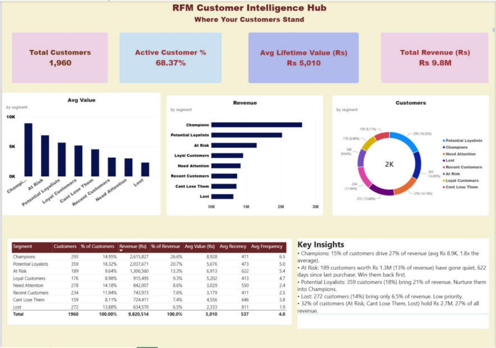
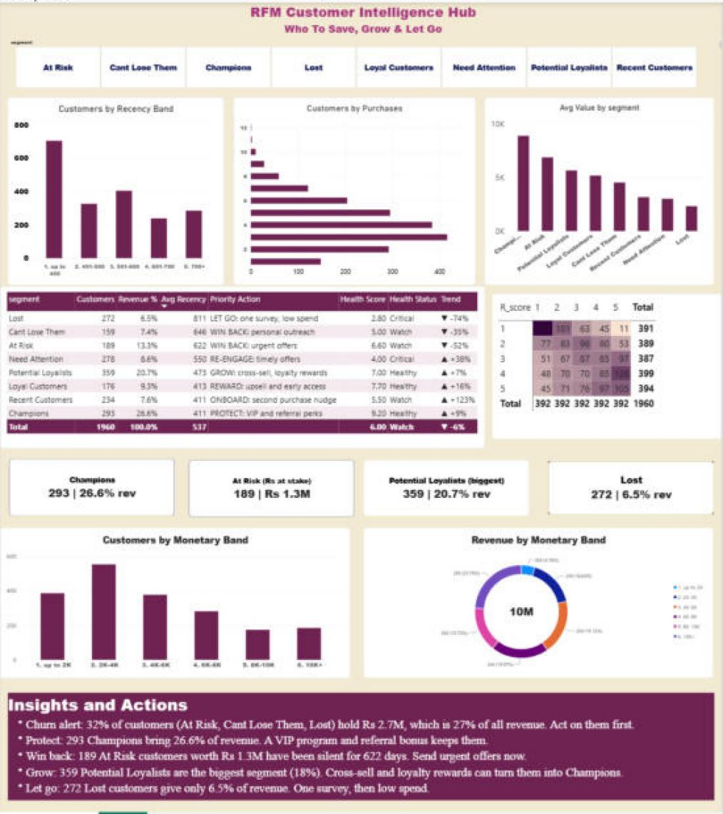

# Customer Segmentation - RFM Analysis

Python builds RFM scores and 8 customer segments from synthetic e-commerce transactions. A 2-page Power BI dashboard reads the result.




## Files

| File | What |
|---|---|
| `rfm_analysis.py` | Generates transactions, scores R/F/M (1-5), assigns segments, writes the CSV |
| `data/rfm_segmentation.csv` | 1,960 customers, 14 columns |
| `RFM_Customer_Segmentation_Dashboard.pbix` | The dashboard |
| `screenshots/` | Both dashboard pages |

## Run

```bash
pip install -r requirements.txt
python rfm_analysis.py
```

Then open the `.pbix`. It reads `data/rfm_segmentation.csv` from this repo on GitHub, and falls back to the local copy at `data/rfm_segmentation.csv` if offline. If your clone lives elsewhere, edit the fallback path: Home > Transform data > Source.

Everything on both pages is formula-driven, including the insight text boxes (measures `Insights P1` and `Insights P2`). Change the CSV, refresh, and all numbers and sentences update.

## Segments

Champions, Loyal Customers, Potential Loyalists, Recent Customers, Need Attention, At Risk, Cant Lose Them, Lost.

## Dashboard

**Page 1, Where Your Customers Stand:** 4 KPI cards (customers, active %, avg lifetime value, revenue), customers / revenue / avg value by segment, segment table, key insights.

**Page 2, The Insights & Actions:** segment slicer, customers by recency band / purchases / avg value, R x F heatmap, scorecard (priority action, health score, status, trend), 4 segment cards, monetary band charts.

## Key measures

```
Active Customer % = DIVIDE(CALCULATE(COUNTROWS(rfm_segmentation),
    NOT(rfm_segmentation[segment] IN {"At Risk", "Cant Lose Them", "Lost"})),
    COUNTROWS(rfm_segmentation))

Health Score = ROUND(AVERAGEX(rfm_segmentation, VALUE(rfm_segmentation[rfm_score])) / 5 * 10, 1)

Health Status = SWITCH(TRUE(), [Health Score] >= 7, "Healthy", [Health Score] >= 5, "Watch", "Critical")

Trend = (2024 revenue - 2023 revenue) / 2023 revenue, from revenue_2023 and revenue_2024
```

Recency is counted in days up to the day after the last transaction (2024-12-31), so the most recent buyer has recency 1. "Active" means every segment except At Risk, Cant Lose Them and Lost.

Data is synthetic (fixed seed 42).
